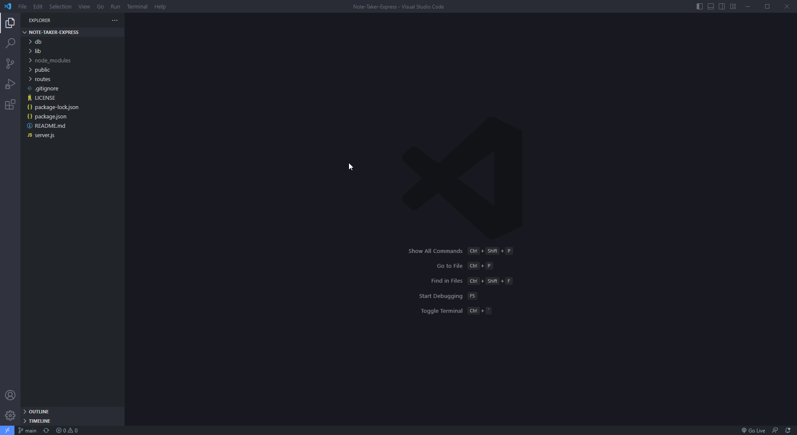

# Note-Taker-Express
## Created By
   - 
   - Cory 
   - @MacaroniKetchup, 
## Table of Contents
  - [Description](#description)
  - [Installations](#installations)
  - [Usage](#usage)
  - [Contact-Info](#contact)
  - [Contributions](#contributions)
  - [Testing](#testing)
  
* [License](#license)

## Description
This application is a simple note taker that allows you to title your notes as well as write text, and save it for later to access them at a later time, while being able to delete any previous notes from before!
## Heroku / Github Deployment
- [Github Repo](https://github.com/MacaroniKetchup/Note-Taker-Express)
- [Heroku](https://gentle-falls-91794.herokuapp.com/)
## Demo Video

## Installations
- Express.js
- uuid
## Usage
Open the terminal and install Express.js by entering 'npm i express' into the terminal as well as installing uuid by typing 'npm i uuid' in the terminal as well. Once those packages are confirmed to be working. In  your terminal access the server by typeing "node server.js" in the root directory, and you'll receive a confermation saying "App listening on PORT: 🏍️ 3001". After that open your browser and type localhost:3001 into your searchbar on the top of your browser, and you'll be directed to the note take app. Once on the main page clikc the "Get Started" button and from there you can enter a Note Title with some text underneath your title, and click on the save button located on the top right coner of your browser, and your note will be saved to the left side of the application where you can click on the Title to display previous notes written as well as clicking on the trash can button to delete previous notes!
## Programs Used
- Express.js
- VSCode
- uuid
- insomnia
## Contact-Info
- Name: Cory
- Email: stylesthestyer@gmail.com
- Github: [MacaroniKetchup](https://github.com/MacaroniKetchup/)
## Testing
```
N/A
```
## License

      licensed under the MIT license.